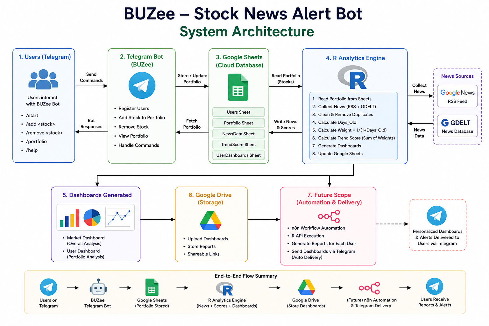
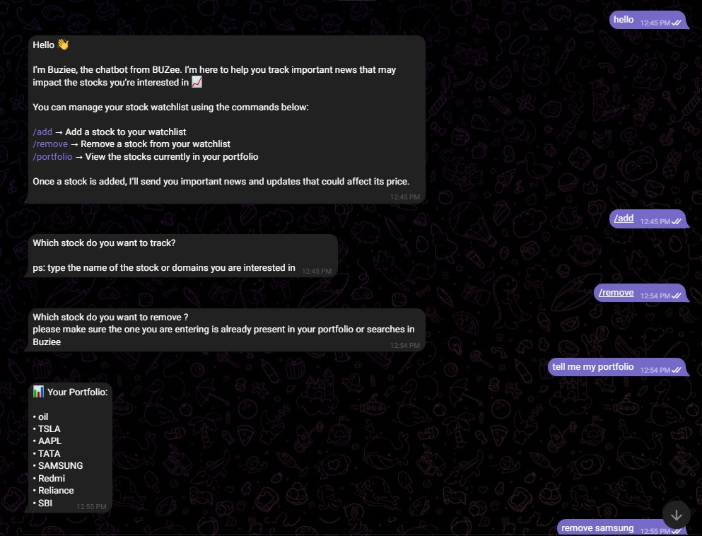
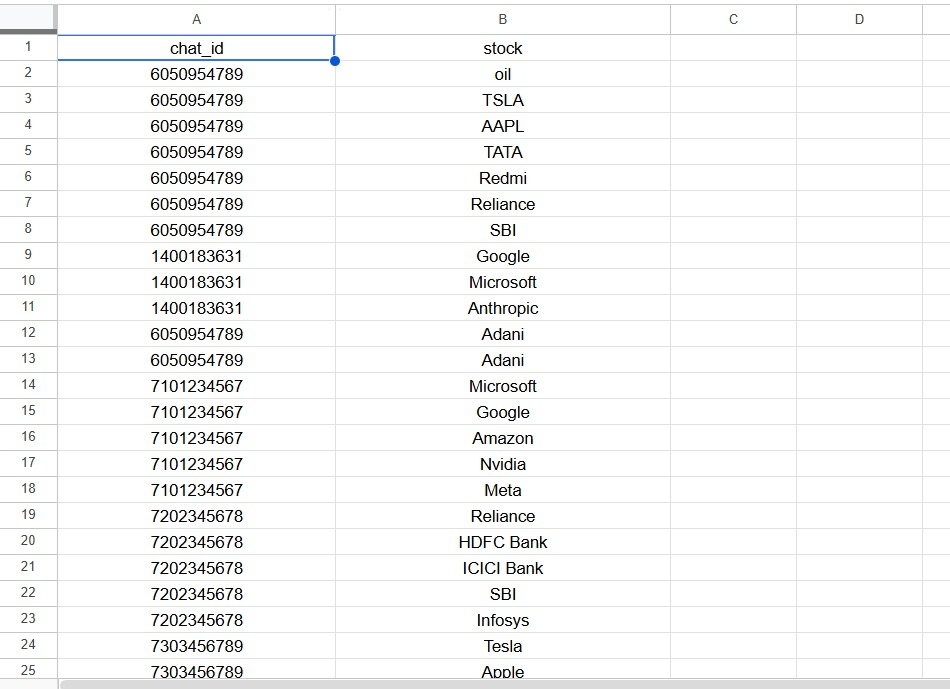
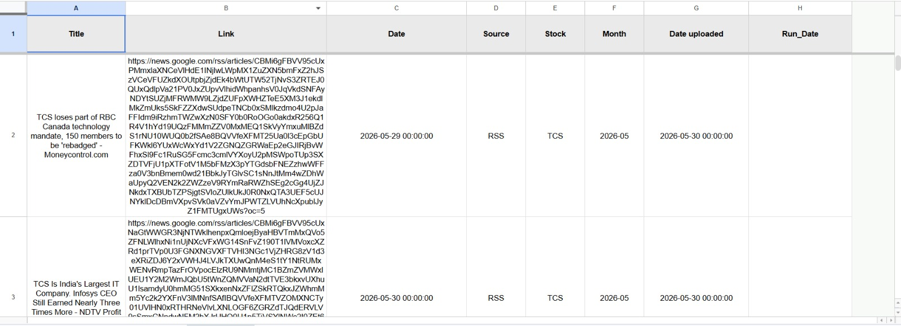
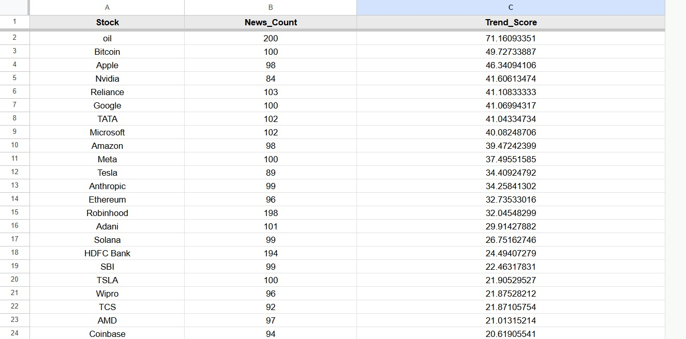
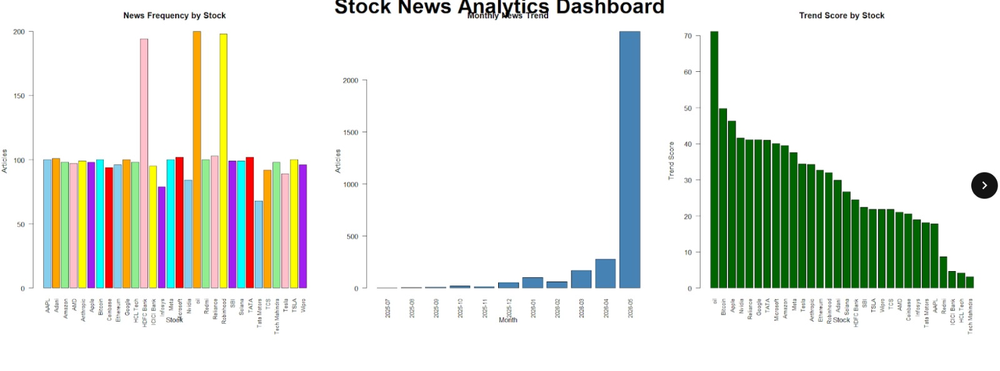
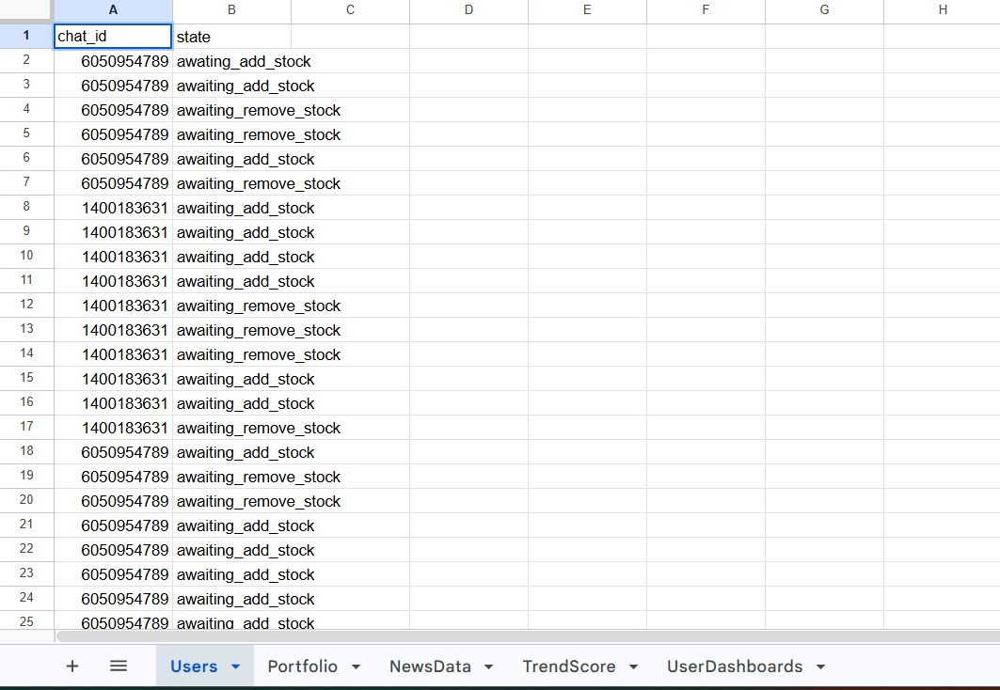
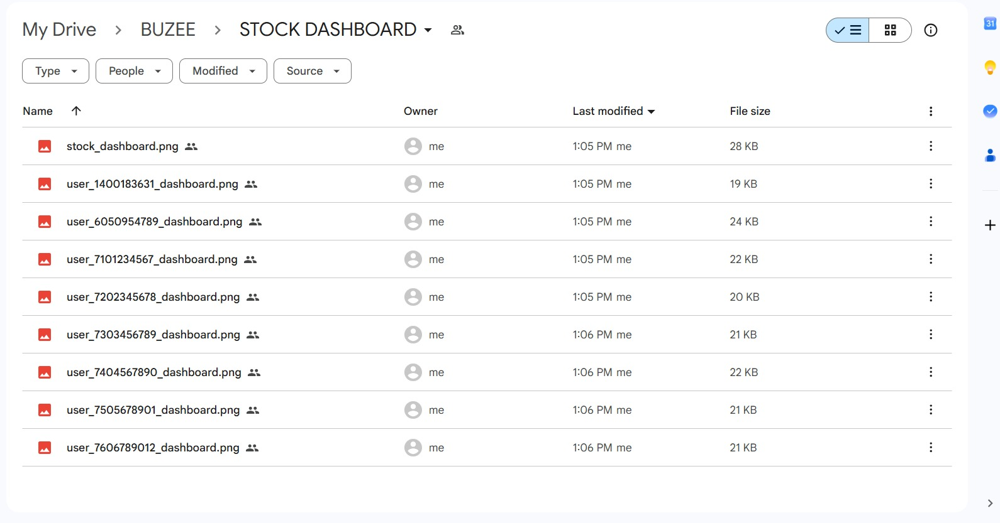
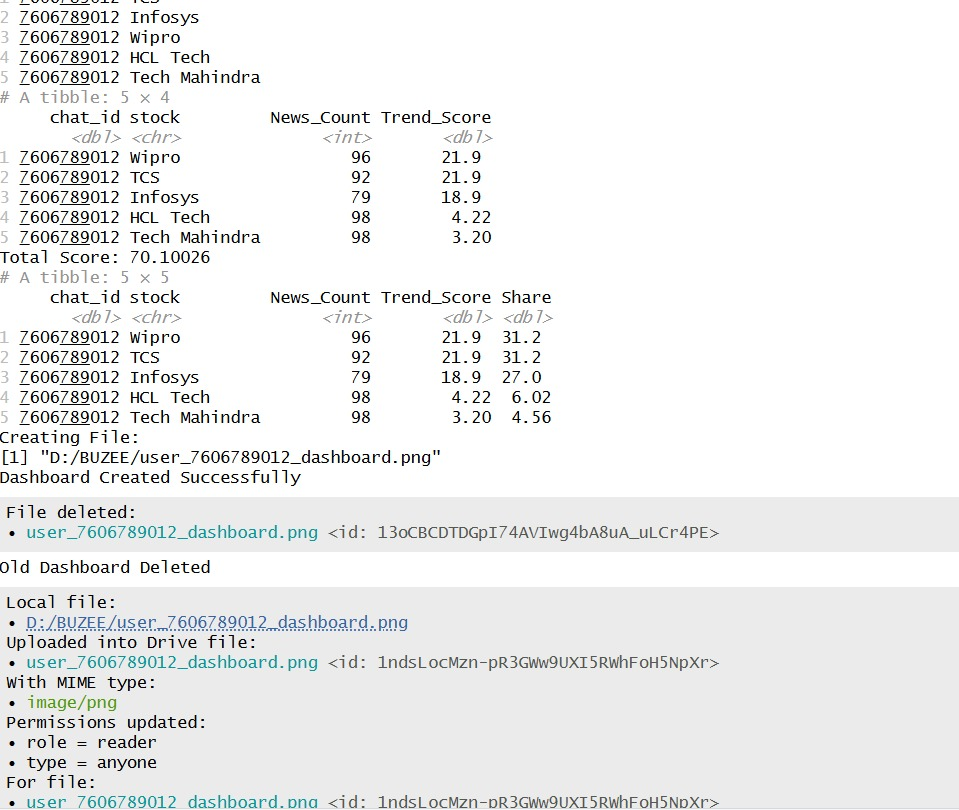

---------------------

# Team Information

## Team Members

| Student Name        | Autonomy Roll Number |
| ------------------- | -------------------- |
| Madhubani Das       |    12624019026       |
| Soumyadeep Ghosh    |    12624019055       |
| Rohit Das           |    12624019041       |
| Sanjeevan Mukherjee |    12624019044       |


## Project Title

BUZee – Automated Stock Trend Intelligence and Portfolio Analytics System using R

## Dataset URL

https://docs.google.com/spreadsheets/d/1dn2rakTrBv2tFjgaXIjXauvQ6c-XVuZskN8oONku6YA/edit?usp=sharing

## Dataset Column Used

STOCK

## GitHub Repository URL

(To be Added)

---

# Problem Statement

Investors often find it difficult to identify which stocks are currently attracting market attention. Traditional methods mainly focus on stock prices and historical performance while ignoring real-time news trends.

The objective of this project is to develop an automated Stock Trend Intelligence System that collects stock-related news, calculates trend scores using recency-weighted analysis, generates dashboards, and provides portfolio-specific insights for users.

---

# System Architecture


```{r, echo=FALSE, out.width="90%", fig.cap="Figure 1.1: SYSTEM ARCHITECTURE"}


```
---

# System Workflow

The system operates in two major stages.

## Stage 1: User Portfolio Management

Users interact with the BUZee Telegram Bot.

The bot provides the following functionalities:

* Add stock to portfolio
* Remove stock from portfolio
* View portfolio
* Manage stock preferences

All portfolio information is automatically stored in Google Sheets.

```{r, echo=FALSE, out.width="90%", fig.cap="Figure 1.2: TELEGRAM BOT - BUZIEE"}

```


## Stage 2: Stock Trend Analytics

The R Analytics Engine reads portfolio information from Google Sheets and performs the following operations:

1. News Collection
2. Data Cleaning
3. Duplicate Removal
4. Trend Score Calculation
5. Dashboard Generation
6. Google Drive Upload

Generated dashboards provide market-wide and portfolio-specific insights.

---

# Dataset Description

The project uses a stock dataset containing company names and stock identifiers.

The primary column selected from the dataset is:

* STOCK

The system dynamically reads stock names from the Portfolio Sheet rather than using hardcoded stock values.


```{r, echo=FALSE, out.width="90%", fig.cap="Figure 1.3: Portfolio"}

```


---

# Data Collection

The system automatically collects stock-related news from multiple sources.

## Google News RSS Feed

Google News RSS is used to retrieve recent news articles associated with stocks present in user portfolios.

## GDELT News Database

GDELT provides additional global news coverage and enhances data collection.

The following information is collected:

* Stock Name
* News Title
* News Link
* Publication Date
* Source


```{r, echo=FALSE, out.width="90%", fig.cap="Figure 1.4: NewsData"}

```

---

# Data Cleaning and Preprocessing

To ensure high-quality analysis, the following preprocessing operations are performed:

* Duplicate news removal
* Missing value handling
* Date standardization
* Month extraction
* Recency calculations

Additional variables generated:

## Days_Old

Days_Old = Current Date − News Date

## Weight

Weight = 1 / (1 + Days_Old)

Recent news receives greater importance than older news.

---

# Trend Score Calculation

The system calculates a Trend Score to measure market attention.

Formula:

Weight = 1 / (1 + Days_Old)

Trend Score = Sum of Weights of all articles belonging to a stock

Advantages of this approach:

* Gives more importance to recent news
* Reduces influence of outdated articles
* Provides dynamic stock ranking
* Reflects current market attention


```{r, echo=FALSE, out.width="90%", fig.cap="Figure 1.5: TrendScore"}

```


---

# Data Visualizations

The system generates three major visualizations.

## News Frequency by Stock

Displays the number of news articles collected for each stock.

## Monthly News Trend

Shows monthly variations in news activity.

## Trend Score by Stock

Ranks stocks according to current market attention.


```{r, echo=FALSE, out.width="90%", fig.cap="Figure 1.6: Main Dashboard"}

```


---

# Key Findings

The analysis revealed several important observations.

* Recent news has a stronger impact on stock trend rankings.
* High news volume does not necessarily imply a high trend score.
* Trend Score provides a better measure of market attention than article count alone.
* Recency-weighted analysis captures current investor interest more effectively.

---

# User Portfolio Analytics

The system generates personalized dashboards for every user.

Each dashboard contains:

## Portfolio Trend Ranking

Ranks stocks in the user's portfolio according to Trend Score.

## Portfolio Attention Share

Shows the percentage contribution of each stock to the overall portfolio attention score.

Benefits:

* Personalized analysis
* Portfolio-specific ranking
* Identification of trending holdings


```{r, echo=FALSE, out.width="90%", fig.cap="Figure 1.7: user_1400183631_dashboard"}
knitr::include_graphics("screenshots/user_1400183631_dashboard.jpeg")
```


---

# Google Sheets Integration

Google Sheets acts as the central cloud database.

The following sheets are maintained:

* Users
* Portfolio
* NewsData
* TrendScore
* UserDashboards

Benefits:

* Centralized storage
* Easy accessibility
* Real-time updates

```{r, echo=FALSE, out.width="90%", fig.cap="Figure 1.8: Google Sheets"}

```


---

# Google Drive Integration

Generated dashboards are automatically uploaded to Google Drive.

Benefits:

* Dashboard storage
* Easy sharing
* Cloud accessibility


```{r, echo=FALSE, out.width="90%", fig.cap="Figure 1.9:Google Drive Screenshot"}

```


---

# Instructions to Run the Project

## Step 1: Install Required Packages

Install the following packages:

* dplyr
* xml2
* jsonlite
* googlesheets4
* googledrive
* plumber

## Step 2: Load Libraries

Load all required libraries.

## Step 3: Authenticate Google Services

Run:

gs4_auth()

drive_auth()

Authenticate using the Google account associated with the project.

## Step 4: Configure Spreadsheet URL

Specify the Google Spreadsheet URL.

## Step 5: Configure Google Drive Folder ID

Specify the Google Drive Folder ID used for dashboard storage.

## Step 6: Execute Main Script

Run:

source("app.R")

The script performs:

* Portfolio retrieval
* News collection
* Duplicate removal
* Trend score calculation
* Dashboard generation
* Google Sheets updates
* Google Drive uploads

## Step 7: Verify Outputs

Expected Outputs:

### Google Sheets

* NewsData Sheet Updated
* TrendScore Sheet Updated

### Google Drive

* stock_dashboard.png
* user_dashboard.png files


```{r, echo=FALSE, out.width="90%", fig.cap="Figure 1.10: R execution"}

```


---

# Future Scope

The current implementation successfully performs portfolio management, stock trend analytics, dashboard generation, Google Sheets integration, and Google Drive integration.

The following enhancements are proposed for future development.

## Automated Telegram Delivery

Personalized analytics reports can be automatically delivered to users through Telegram.

## n8n Workflow Automation

Proposed workflow:

Telegram User
↓
n8n Trigger
↓
R API
↓
Trend Analysis
↓
Dashboard Generation
↓
Telegram Delivery

## Investor Ranking System

Users can be compared based on:

* Portfolio Trend Score
* Exposure to Trending Stocks
* Relative Ranking Among Users
* Portfolio Attention Share

## Personalized Daily Reports

Users can receive:

* Current Trending Stocks
* Portfolio Ranking
* Portfolio Analytics
* Dashboard Images


---

# Findings and Conclusions

The project successfully demonstrates the development of an Automated Stock Trend Intelligence System using R.

The system integrates Telegram-based portfolio management, cloud-based storage, real-time news collection, trend score analytics, dashboard generation, and Google Drive integration into a unified platform.

The use of recency-weighted Trend Scores ensures that recent market developments receive greater importance than historical news. This enables the system to identify stocks that are currently attracting investor attention.

The generated dashboards provide both market-wide and portfolio-specific insights, helping users understand which stocks are trending and how their holdings compare within their own portfolio.

Google Sheets provides centralized cloud storage, while Google Drive enables automated dashboard management. The modular design of the system allows future expansion through n8n workflow automation and Telegram-based report delivery.

Overall, the project demonstrates practical applications of data collection, data cleaning, analytics, visualization, cloud integration, and automation using R. The proposed future enhancements have the potential to transform the platform into a fully automated stock intelligence and investor analytics system.
